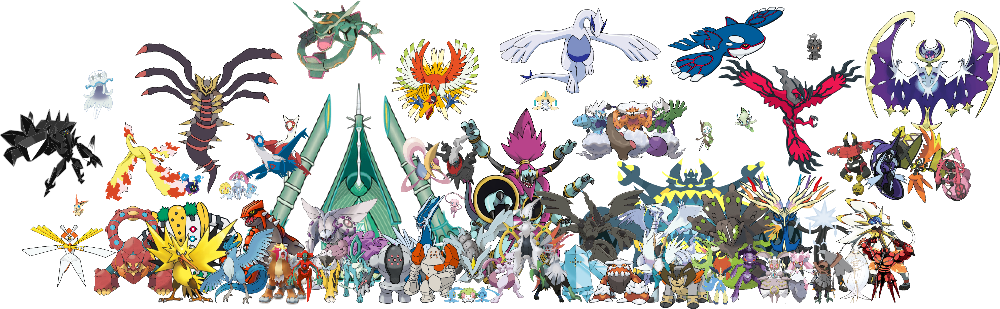

# What Defines a Legendary Pokémon?

What does it mean to be a legendary pokémon? Is its size, weight, or just an arbitrary choice by its creators? In this notebook, I will try to find insights with data across all Pokédex to answer this question, and also train a clustering algorithm to detect **anomalies** in our data, and find the **real legendary pokémons** (spoiler: Gyarados is one of them 🥰)